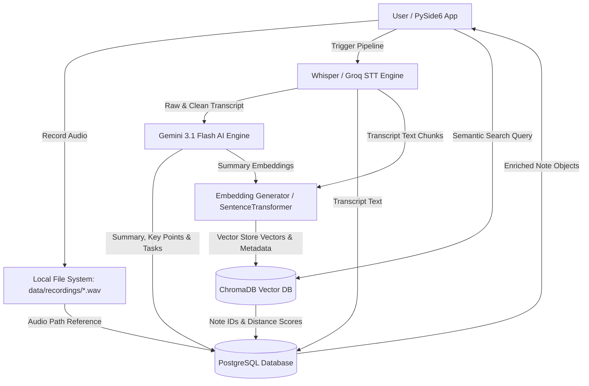

# VoiceNote Dual-Database & Storage Architecture Specification

## 1. High-Level Architecture Overview

VoiceNote uses a hybrid storage architecture comprising three specialized storage tiers:
1. **PostgreSQL**: Relational database for structured metadata, relational entity mappings, transcript text, AI summaries, and actionable task boards.
2. **ChromaDB**: High-performance vector database for storing text embeddings and enabling semantic search across voice notes.
3. **Local File System**: Disk storage for raw audio recordings (`.wav` / `.m4a`).



---

## 2. Storage Tier Responsibilities & Data Mapping

| Storage Tier | Technology | What is Stored | Purpose & Capabilities |
| :--- | :--- | :--- | :--- |
| **Relational Database** | **PostgreSQL** | • Note metadata (`id`, `title`, `duration`, `created_at`, `category`, `audio_path`)<br>• Transcripts (`raw_text`, `cleaned_text`, `language`)<br>• AI Summaries (`summary`, `key_points`, `sentiment`, `main_topics`)<br>• Tasks (`title`, `description`, `priority`, `assignee`, `due_date`, `status`) | • ACID-compliant transaction persistence<br>• Relational foreign key constraints (`ON DELETE CASCADE`)<br>• Structured queries & filter by date, category, status<br>• Action item tracking and updating |
| **Vector Database** | **ChromaDB** | • 384-dim / 768-dim text vector embeddings of transcripts & summaries<br>• Document Chunks & Metadata (`note_id`, `chunk_index`, `category`, `created_at`) | • Fast cosine similarity vector search<br>• Natural language semantic queries (e.g. *"What did we decide about vector search?"*)<br>• AI RAG (Retrieval-Augmented Generation) context lookup |
| **File Storage** | **Local Disk (`data/recordings/`)** | • Raw uncompressed `.wav` / compressed `.m4a` audio files | • Instant zero-latency audio playback in PySide6 UI<br>• Keeps PostgreSQL lightweight and responsive |

---

## 3. PostgreSQL Database Schema

```sql
-- 1. Notes Table
CREATE TABLE notes (
    id SERIAL PRIMARY KEY,
    title VARCHAR(255) NOT NULL,
    created_at VARCHAR(100) NOT NULL,
    duration VARCHAR(50) DEFAULT '00:00',
    audio_path TEXT,
    category VARCHAR(100) DEFAULT 'General'
);

-- 2. Transcripts Table
CREATE TABLE transcripts (
    id SERIAL PRIMARY KEY,
    note_id INTEGER NOT NULL REFERENCES notes(id) ON DELETE CASCADE,
    raw_text TEXT NOT NULL,
    cleaned_text TEXT,
    language VARCHAR(20) DEFAULT 'en'
);

-- 3. AI Summaries Table
CREATE TABLE ai_summaries (
    id SERIAL PRIMARY KEY,
    note_id INTEGER NOT NULL REFERENCES notes(id) ON DELETE CASCADE,
    summary TEXT NOT NULL,
    key_points TEXT, -- JSON array
    sentiment VARCHAR(50) DEFAULT 'Neutral',
    main_topics TEXT  -- JSON array
);

-- 4. Actionable Tasks Table
CREATE TABLE tasks (
    id SERIAL PRIMARY KEY,
    note_id INTEGER NOT NULL REFERENCES notes(id) ON DELETE CASCADE,
    title VARCHAR(255) NOT NULL,
    description TEXT,
    priority VARCHAR(50) DEFAULT 'Medium',
    assignee VARCHAR(100) DEFAULT 'Unassigned',
    due_date VARCHAR(100) DEFAULT 'TBD',
    status VARCHAR(50) DEFAULT 'Pending'
);
```

---

## 4. ChromaDB Vector Database Schema

In ChromaDB, notes are stored inside a dedicated collection named `voicenote_embeddings`:

### **Document Structure in ChromaDB:**
* **`id`**: `note_{note_id}_chunk_{chunk_id}` (e.g., `note_4_chunk_0`)
* **`document`**: Text snippet or full clean transcript / summary paragraph.
* **`embedding`**: Float vector array generated via `all-MiniLM-L6-v2` or `text-embedding-004`.
* **`metadata`**:
  ```json
  {
    "note_id": 4,
    "title": "Sprint Planning & Architecture",
    "category": "Architecture",
    "created_at": "2026-08-19 01:00",
    "sentiment": "Positive"
  }
  ```

---

## 5. End-to-End Search & Retrieval Workflow

1. **User types a search query**: e.g., *"Who is working on the background thread worker?"*
2. **ChromaDB Query**: The query string is converted to an embedding and compared against all stored document vectors in ChromaDB using cosine distance.
3. **ID Resolution**: ChromaDB returns matching `note_id`s ranked by relevance score.
4. **PostgreSQL Fetch**: The app uses the retrieved `note_id`s to fetch full note metadata, audio playback path, and tasks from PostgreSQL.
5. **UI Rendering**: Results are displayed in the PySide6 UI with audio playback controls and summary insights.
